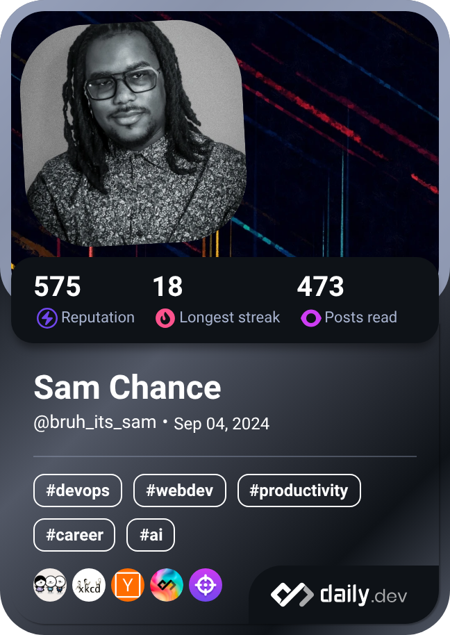

# 👋 Hi, I'm Sam!

I'm a software/systems engineer and aspiring vulnerability researcher with a deep passion for technology. I enjoy working on innovative projects, exploring new tech, and sharing my findings.

- 🌱 I’m continuously learning about cybersecurity and software development.
- ✍️ I've been working on a [blog](https://nullexport.substack.com/) that explores the intersection of privacy, security, and social media.
- 💬 Feel free to reach out if you'd like to collaborate or chat about tech!
- 📫 **How to reach me:** Email should work.

## Thanks for stopping by!

---

<!--
**sec252/sec252** is a ✨ _special_ ✨ repository because its `README.md` (this file) appears on your GitHub profile.

Here are some ideas to get you started:

- 🔭 I’m currently working on ...
- 🌱 I’m currently learning a bunch of things
- 👯 I’m looking to collaborate on ...
- 🤔 I’m looking for help with ...
- 💬 Ask me about ...
- 📫 How to reach me: ...
- 😄 Pronouns: ...
- ⚡ Fun fact: ...
-->
