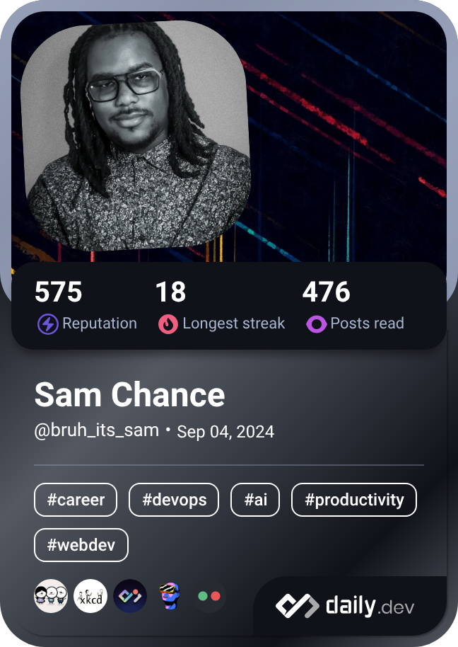

# Hi, I'm Sam 👋

> **Building systems. Studying technology. Sharing what I learn.**

Welcome to my corner of GitHub.

I'm an engineer driven by curiosity and a desire to understand how technology works—from the infrastructure that powers modern applications to the human factors that shape how technology is built, trusted, and secured.

I enjoy building software, automating infrastructure, experimenting with new technologies, and documenting what I learn through research and writing. Whether I'm deploying cloud infrastructure, exploring AI, analyzing security concepts, or designing a new project, my goal is always the same: understand it deeply enough to explain it clearly.

## Current Areas of Interest

* 💻 Software Engineering
* ☁️ Cloud Infrastructure & DevSecOps
* 🔒 Cybersecurity
* 🤖 Artificial Intelligence
* 🧠 Computer Science Research
* 🌐 Technology & Human Behavior

## Current Projects

* 🛠️ Building open-source tools and infrastructure projects
* 🔬 Researching AI, digital literacy, and cybersecurity
* 🏠 Expanding a self-hosted home lab for experimentation
* ✍️ Writing technical articles and research at **[NullExport](https://nullexport.com/)**

## Philosophy

I believe the best way to learn is to build.

This profile is a collection of experiments, research, and projects that reflect that philosophy. Some repositories are polished tools, others are proofs of concept, and some exist simply because I wanted to answer a question.

If something here helps you learn, solve a problem, or sparks a new idea, then it has accomplished its purpose.

## Connect

* 📫 Email is the best way to reach me.
* 🤝 I'm always open to collaborating on open-source, infrastructure, and research projects.

---

<!--
**sec252/sec252** is a ✨ _special_ ✨ repository because its `README.md` (this file) appears on your GitHub profile.

Here are some ideas to get you started:

- 🔭 I’m currently working on ...
- 🌱 I’m currently learning a bunch of things
- 👯 I’m looking to collaborate on ...
- 🤔 I’m looking for help with ...
- 💬 Ask me about ...
- 📫 How to reach me: ...
- 😄 Pronouns: ...
- ⚡ Fun fact: ...
-->
